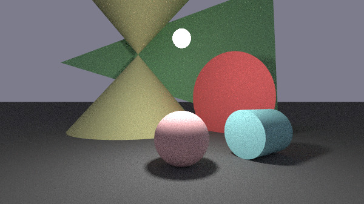
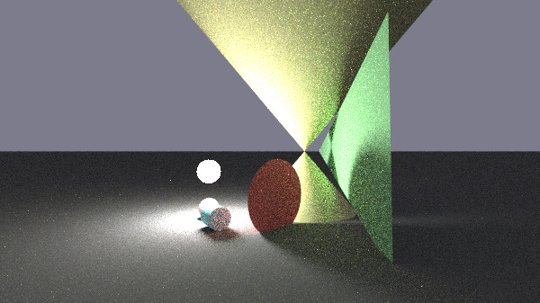
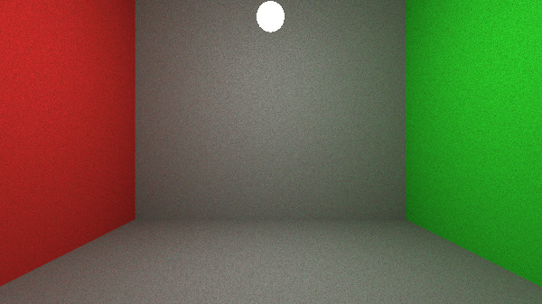
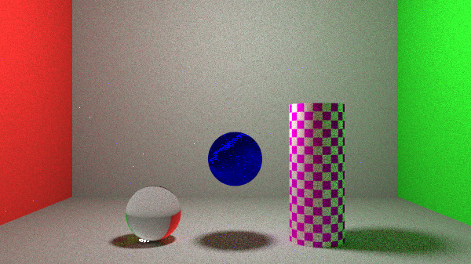
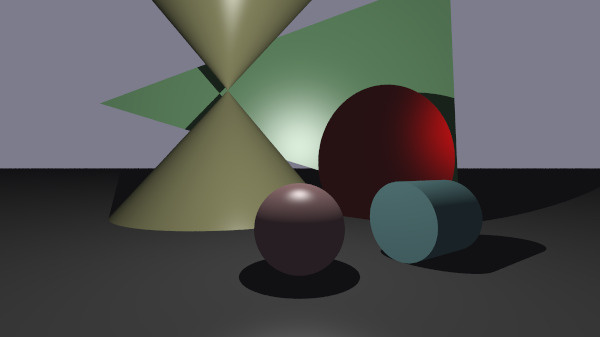
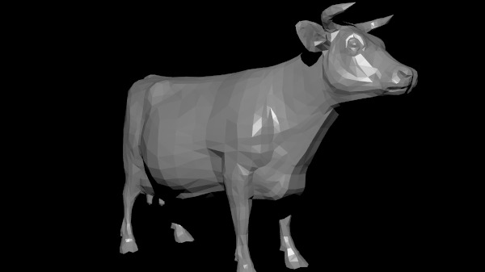
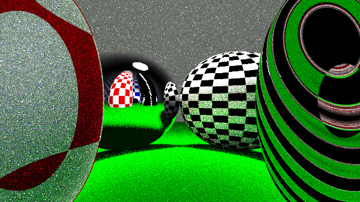

# miniRT
*This project has been created as part of the 42 curriculum by khanadat, ikawamuk*

## Description

### What is miniRT
miniRT is a project in the 42 curriculum that involves implementing a ray tracer using the C language.

### Features
- Ambient lighting, spot light sources, and camera settings
	
	
- geometries, including spheres, planes, and cylinders.
	
- Various textures and materials
	

### Technical Features
- Support for both Path Tracing and the Phong Reflection Model.
	
	
- Optimization using AABB (Axis-Aligned Bounding Box) and BVH (Bounding Volume Hierarchy).

## Instructions
1. Clone the repository:
```bash
git clone git@vogsphere-v2.42tokyo.jp:vogsphere/intra-uuid-46f583b3-8acf-49dd-8cf6-0ed0221ba73c-7112890-khanadat miniRT && cd ./miniRT
```
2. Compile the project using the provided Makefile:
```bash
make
```
3. execute `miniRT`:
```bash
./miniRT test.rt
```
> Print the formats with no command line arguments:
```bash
./miniRT
```

## Gallery






## Resources

### Articles & Documentation
- [Ray Tracing in One Weekend](https://raytracing.github.io/)
- [Shumatsu Ray tracing](https://inzkyk.xyz/ray_tracing_in_one_weekend/)
- [JUN's blog](https://jun-networks.hatenablog.com/entry/2021/04/02/043216)
- [Ray tracing nyumon](https://zenn.dev/mebiusbox/books/8d9c42883df9f6)
- [memoRANDOM](https://rayspace.xyz/)
- [yobinori](https://www.youtube.com/watch?v=aNoEzONgIYo)
- [Bounding Volume Hierarchy(BVH)](https://qiita.com/omochi64/items/9336f57118ba918f82ec)

### AI Usage
Clarifying concepts, Troubleshooting & Debugging, Answering technical queries:
- Gemini  
- ChatGPT  
## Additional Outputs
[the notes of miniRT](https://qiita.com/ikawamu/items/a1467bc9f8541250b9a8)